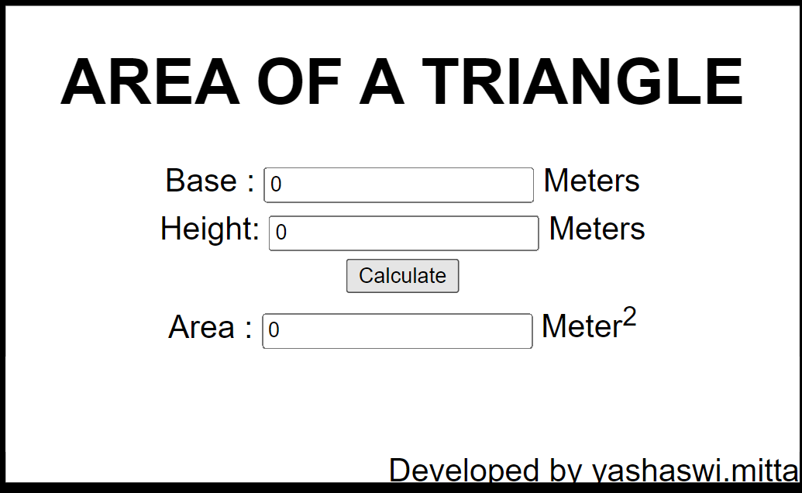
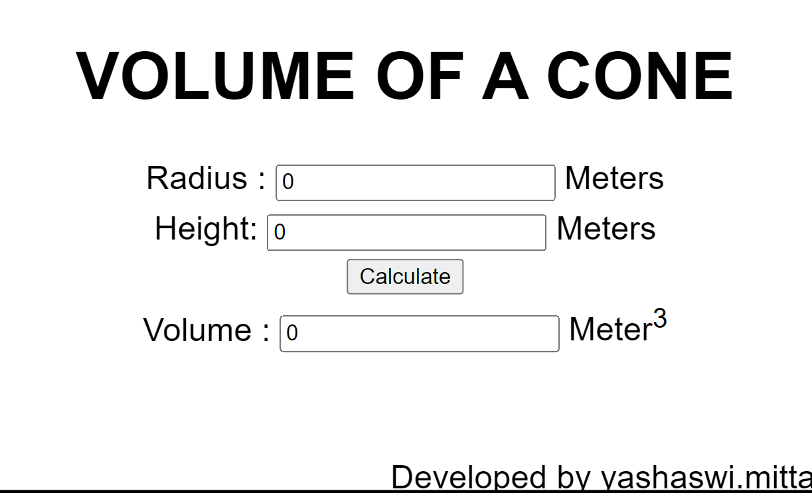

# Web Page for Mathematical Calculations

## AIM:

To design a static website with validation to perform mathematical calculations in client side.

## DESIGN STEPS:

### Step 1:

Requirement collection.

### Step 2:

Creating the layout using HTML and CSS.

### Step 3:

Write javascript to perform the calculations.

### Step 4:

Include regularexpression based input validation.

### Step 5:

Validate the layout in various browsers.

### Step 6:

Validate the HTML code.

### Step 6:

Publish the website in the given URL.

## PROGRAM :

~~~
<!DOCTYPE html>
<html lang="en">
<head>
    <meta charset="UTF-8">
    <meta http-equiv="X-UA-Compatible" content="IE=edge">
    <meta name="viewport" content="width=device-width, initial-scale=1.0">
    <title>MATHEMATICS CALCULATION</title>
    
</head>
<body>
    

        

            <h1>AREA OF A TRIANGLE</h1>
            <form>
                

                    <label for="bedit">Base    :</label>
                        <input type="text" name="base" id="bedit" value="0"/> <label>Meters</label>
                

                

                    <label for="hedit">Height:</label>
                        <input type="text" name="height" id="hedit" value="0"/> <label>Meters</label>
                

                

                    <input type="button" value="Calculate" id="addbutton"/>
                

                

                    <label for="cedit">Area :</label>
                        <input type="text" id="cedit" value="0" readonly/> <label>Meter2</label>
                

                

                 Developed by yashaswimitta
                  

            </form>

        

    

    
     
    

        

            <h1>VOLUME OF A CONE</h1>
            <form>
                

                    <label for="Redit">Radius    :</label>
                        <input type="text" id="Redit" value="0"/> <label>Meters</label>
                

                

                    <label for="Hedit">Height:</label>
                        <input type="text" id="Hedit" value="0"/> <label>Meters</label>
                

                

                    <input type="button" value="Calculate" id="vbutton"/>
                

                

                    <label for="vedit">Volume :</label>
                        <input type="text" id="vedit" value="0" readonly/> <label>Meter3</label>
                

                

                    Developed by yashaswimitta
                     

            </form>

        

    

    

</body>
</html>
~~~

## OUTPUT:

## Result:

Thus a website is designed to perform mathematical calculations in the client side.
